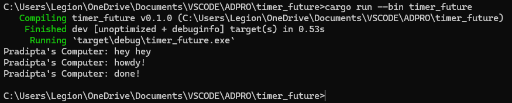
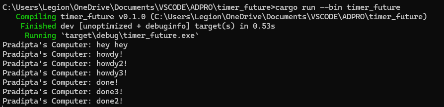

## Pradipta Arya P. - 2206083685
### Module 10 - Timer

**1.2 Understanding How it Works**

Dapat dilihat dari output bahwa "hey hey" akan muncul pertama karena "hey hey" berada di fungsi main diluar fungsi async dengan mekanisme delay.

**1.3 Multiple Spawn and Removing Drop**

Dapat dilihat dari output, dengan bertambahnya spawners, akan bertambah juga program yang di-queue, maka seluruh "howdy" akan keluar dahulu karena mereka dieksekusi segera setelah scheduling tiap task. Lalu setelah delay, seluruh message "done!" akan muncul setelah semua timer selesai. Lalu dengan penghapusan "drop(spawner)" akan menyebabkan bahwa seluruh spawner tidak didrop, sehingga menyebabkan program tidak dapat diselesaikan. 